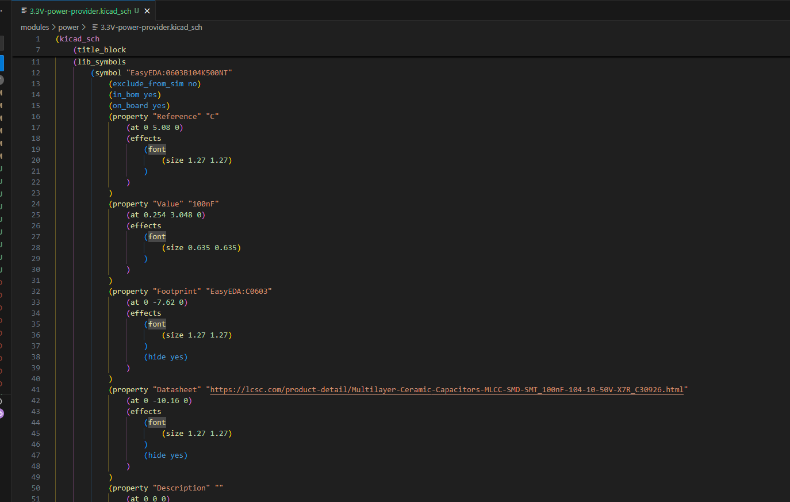
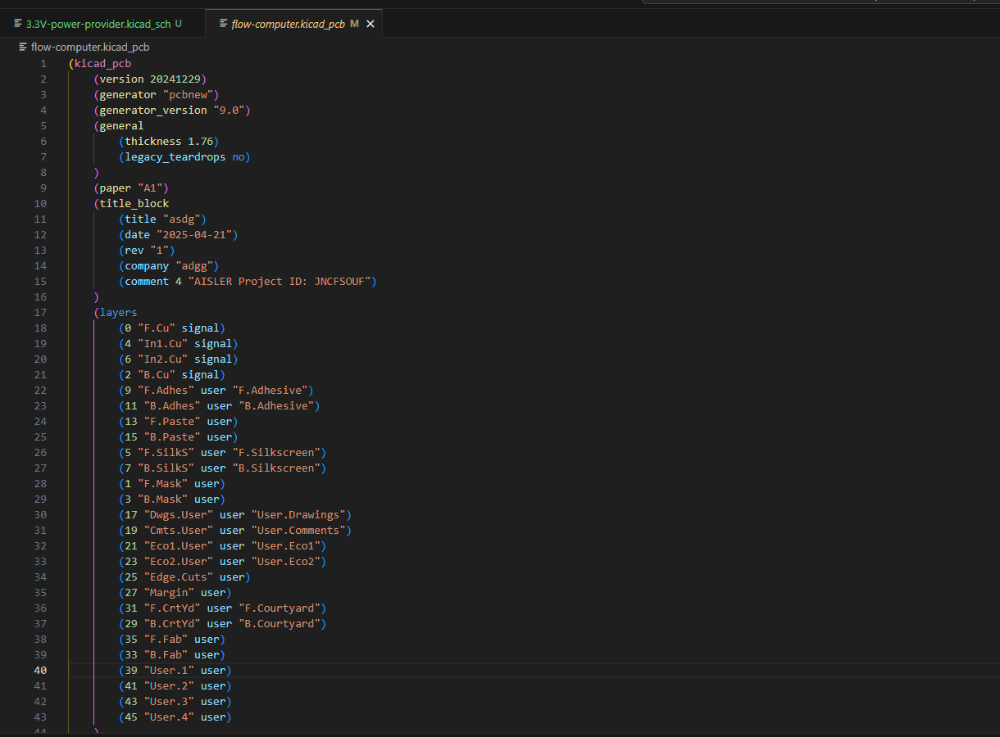

# KiCad Syntax Highlighter for VS Code

.

## Development

### Building the Extension

1. Clone the repository
2. Run `npm install` to install dependencies
3. Run `npm run package` to create a `.vsix` file

### Publishing

This extension uses GitHub Actions for automated publishing. To publish a new version:

1. Create a new GitHub release
2. The GitHub Action will automatically build and publish the extension to the VS Code Marketplace

Alternatively, you can manually trigger the publish workflow from the Actions tab on GitHub.

## Licenseighlighter](images/extension-icon.png)

This extension provides syntax highlighting for KiCad schematic, PCB, and related files in Visual Studio Code.

## Features

- Syntax highlighting for KiCad files using s-expression syntax
- Support for multiple KiCad file formats:
  - Schematic files (.kicad_sch, .sch)
  - PCB files (.kicad_pcb)
  - Component libraries (.lib, .kicad_sym)
  - Footprint files (.kicad_mod)
  - Project files (.kicad_pro)
  - And more...

## Screenshots

## Supported File Extensions

- `.kicad_pro` - KiCad project files
- `.kicad_sch` - KiCad schematic files
- `.kicad_pcb` - KiCad PCB files
- `.kicad_mod` - KiCad footprint module files
- `.kicad_sym` - KiCad symbol files
- `.kicad_wks` - KiCad worksheet files
- `.sch` - Legacy schematic files
- `.lib` - Legacy library files
- `.kicad_pcb-bak` - KiCad PCB backup files
- `.kicad_sch-bak` - KiCad schematic backup files
- `.net` - Netlist files
- `.dsn` - Specctra DSN files
- `.kicad_dru` - Design rules files
- `.fp-lib-table` - Footprint library tables
- `.sym-lib-table` - Symbol library tables

## Installation

1. Open VS Code
2. Go to Extensions (Ctrl+Shift+X)
3. Search for "KiCad Syntax Highlighter"
4. Click Install

## About KiCad

[KiCad](https://www.kicad.org/) is a free and open-source electronics design automation (EDA) suite for designing schematics and PCBs.

## Issues and Contributions

If you find any issues or have suggestions for improvements, please submit an issue or pull request on the [GitHub repository](https://github.com/demezaa/kicad-syntax-highlighter).

## License

This extension is licensed under the [MIT License](LICENSE).
